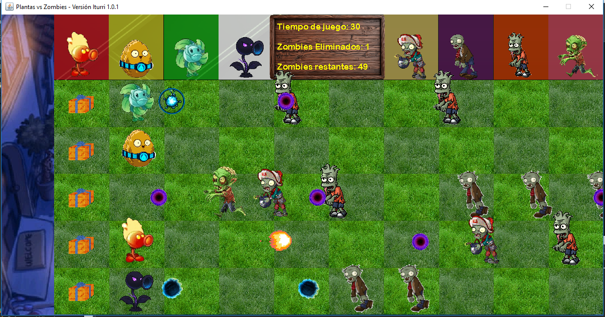

## Capturas

# Plantas vs. Zombies

Simulación del juego **Plantas vs. Zombies** desarrollada en **Java** como proyecto de la materia **Programación I**.

El juego utiliza un entorno gráfico provisto por la cátedra que permite controlar eventos del mouse y del teclado para interactuar con el juego. Se implementan las principales mecánicas de juego, como la colocación de plantas, el movimiento de enemigos y el disparo de proyectiles.

## Tecnologías utilizadas

- Java
- Entorno gráfico provisto por la cátedra

## Funcionalidades

- Colocación de plantas mediante el mouse.
- Movimiento de enemigos.
- Disparo automático de proyectiles.
- Gestión de la lógica principal del juego.

## Autor

Carlos Iturri
